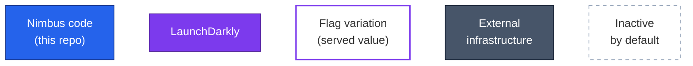
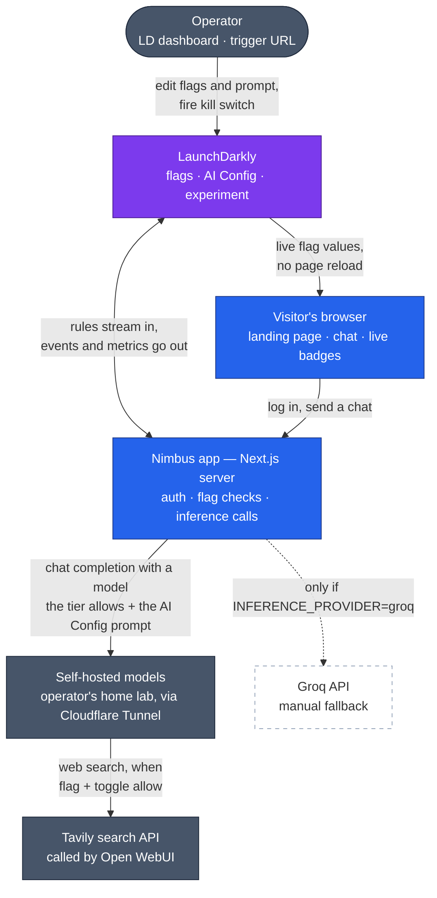
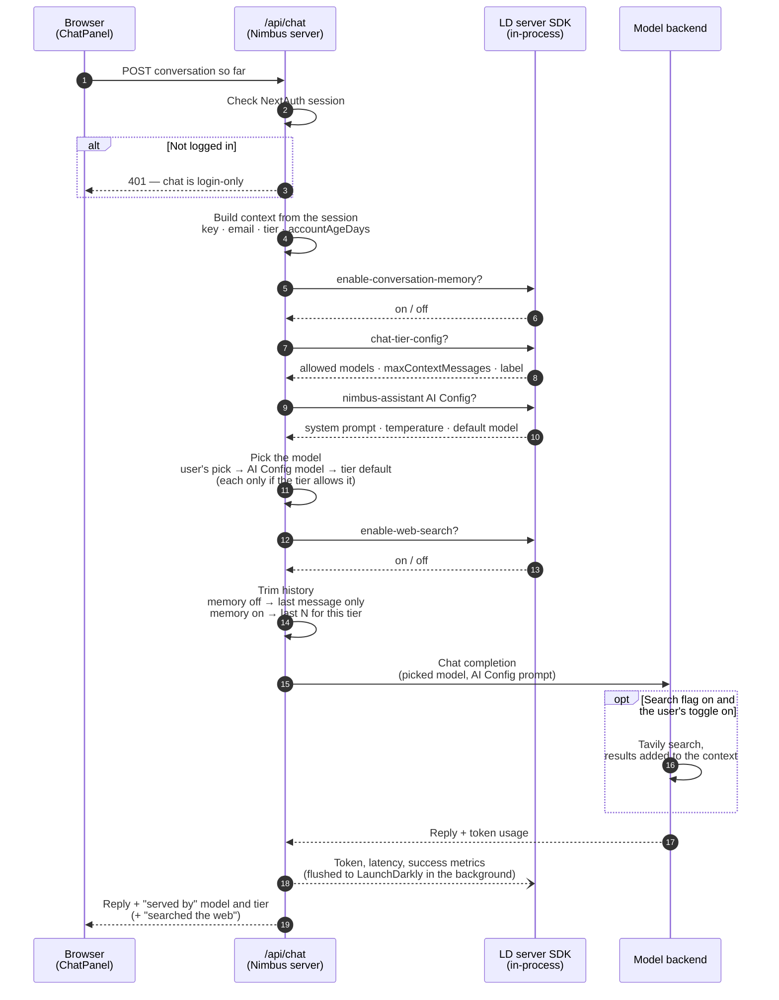
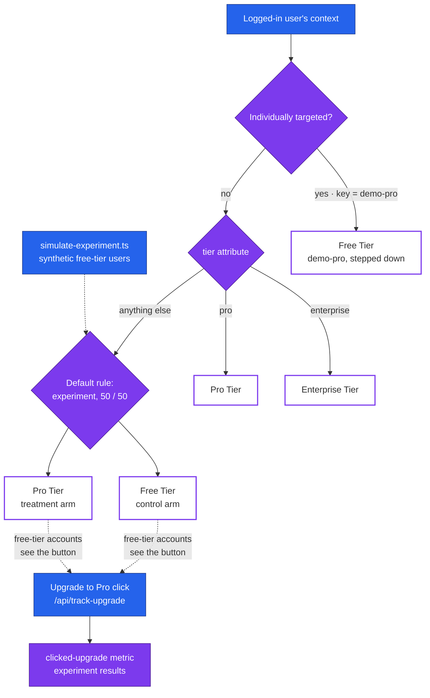
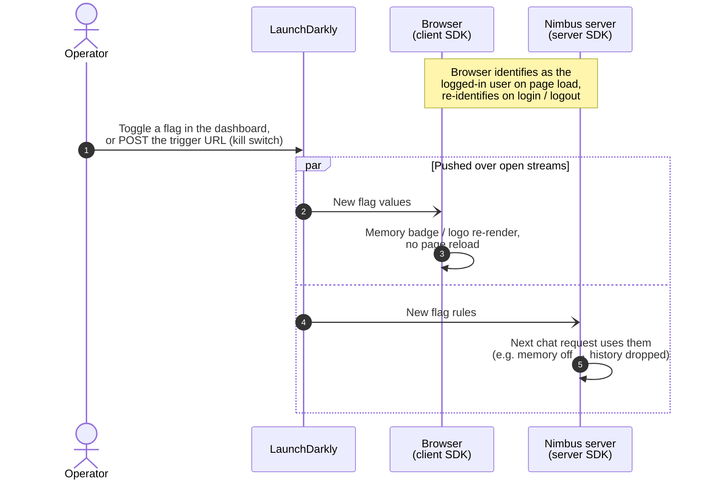

# Architecture & Decisions

Status snapshot as of this document: **release/remediate, targeting,
experimentation, AI Configs, per-tier model menus, and flag-gated web search
are complete.**
Flag-gated image generation is implemented and a live call returned a PNG.
When the toggle is on, that turn's prompt goes to Open WebUI's image API,
which paints it with ComfyUI and stores the file. Nimbus downloads that
file and shows it in the thread.
The app runs in two places on purpose: **self-hosted via Docker alongside the
model backend**, where everything works, and **Vercel**
([nimbus-ai-sample.vercel.app](https://nimbus-ai-sample.vercel.app/)), where
everything except chat works. Both read the same LaunchDarkly environment, so
one dashboard change moves both. See "Deployments" below for why the split
exists.
Third-party integrations are not yet built. This file exists so the build
can be picked back up or handed off without re-deriving the reasoning
behind it.

## What this app is

**Nimbus** is a self-contained demo project: a small SaaS-style landing page
for a tiered AI chat product (Free / Pro / Enterprise). It is not a real
product — there's no billing, no real user database, no production traffic.
The point of the project is to explore how LaunchDarkly's feature-flag,
targeting, and experimentation tools fit into a real tiered-SaaS pattern,
using tiered model/context access as the running example, since that's a
genuine, common way teams use feature management — not a toy scenario.

Three design constraints have shaped every decision below:
1. **Zero ongoing cost** — the operator didn't want to pay to run this.
2. **No security regression** — nothing here should weaken the operator's
   existing home-lab security posture (see "Cloudflare isolation" below).
3. **A stranger can run it** — anyone should be able to clone the repo and
   get the app running without needing the operator's own infrastructure,
   even though the *deployed* instance depends on it (see "Known gaps").

## Status

| Feature | Status | Flag(s) |
|---|---|---|
| Release & remediate (toggle a feature live, roll it back via a trigger) | ✅ Done, tested | `enable-conversation-memory` |
| Targeting (rule-based + individual overrides) | ✅ Done, tested | `chat-tier-config` |
| Experimentation (metric + experiment on the same flag) | ✅ Done, tested | `chat-tier-config` + `clicked-upgrade` metric |
| AI Configs (managed prompt, parameters and default model) | ✅ Done, tested | `nimbus-assistant` (AgentControl config, separate from the flags above) |
| Model menu per tier (selectable + greyed-out upsell models) | ✅ Done, tested live for each tier, including refused requests for locked models | `chat-tier-config` + `nimbus-assistant` default |
| Web search (Open WebUI + Tavily), all tiers | ✅ Done, tested | `enable-web-search` |
| Image generation, all tiers | ✅ Done. Prompt routes to Open WebUI's image API; a live call returned a PNG in about 50s | `enable-image-generation` |
| Third-party integrations | ⏳ Parked, lowest priority — see "Known gaps" | — |
| Self-hosted deployment (Docker, beside Open WebUI) | ✅ Full functionality — the one to demo from | — |
| Vercel deployment | ⚠️ Everything but chat; Cloudflare challenges its requests to the backend. Kept as deploy proof. See "Deployments" | — |
| README setup instructions | ✅ Done | — |

## Architecture

Four small diagrams, each answering one question, instead of one diagram
that tries to show everything. Start with the big picture; the other three
zoom into one flow each.

**Legend** (used in every flowchart below):

### 1. The big picture — who talks to whom

Two LaunchDarkly SDKs are deliberately both in play, with different jobs:

- **Server SDK (inside the Nimbus app)** makes every decision that matters
  for security or cost — which model to call, how much history to send, which
  prompt to use. It keeps a streamed copy of the flag rules in memory and
  evaluates them locally, so a chat request never waits on a round trip to
  LaunchDarkly; analytics events and AI metrics are sent back in batches.
- **Client SDK (in the browser)** only drives display: the live "Memory:
  On/Off" badge, the logo swap, whether the web search and image toggles
  are offered, and the model menu. It identifies as the same logged-in user
  the server evaluates for, but nothing it says is trusted for access
  decisions — the server re-checks everything itself.

The model backend is a manual switch, not a failover: self-hosted by
default, Groq only when `INFERENCE_PROVIDER=groq` is set explicitly.

### 2. What happens when you send a chat message

Every LaunchDarkly answer above comes from the SDK's in-memory copy of the
rules, built from the session — never from anything the browser sends. The
browser's model pick is only a request, checked against the tier's list.
Two systems, two jobs: `chat-tier-config` decides *which models and how
much history* a tier is allowed (access control), while the
`nimbus-assistant` AI Config decides *how the assistant talks* and which
allowed model is the default — see "Key decisions" below.

### 3. How `chat-tier-config` picks a tier — targeting and the experiment

Each outlined box is one of the flag's three JSON variations,
`{ label, maxContextMessages, defaultModel, models, lockedModels }`. LaunchDarkly checks individual
targets before rules, which is why `demo-pro` lands on Free despite its
`pro` tier. Enterprise Tier is deliberately left out of the experiment so
free-tier traffic can never be randomly routed to the most expensive model.

### 4. Live changes without a redeploy — release and remediate

The same path covers editing the AI Config's prompt or temperature: the
next chat reply reflects it, with no redeploy.

### Where each piece lives

| Piece | File(s) |
|---|---|
| Landing page, header, badges | `app/page.tsx`, `components/BrandLogo.tsx`, `components/MemoryStatusBadge.tsx` |
| Chat UI, model menu | `components/ChatPanel.tsx` |
| Tier config shape, validation, model choice | `lib/tier-config.ts` |
| Client SDK setup + user identify | `components/LDClientProvider.tsx`, `components/LDUserSync.tsx`, `app/layout.tsx` |
| Login (3 static demo accounts) | `app/login/page.tsx`, `lib/auth.ts`, `lib/demo-users.ts` |
| Chat request handling | `app/api/chat/route.ts` |
| Server SDK + context builder | `lib/ld-server.ts` |
| Fallback values if LD is unreachable | `lib/tier-config.ts`, `lib/ai-config.ts` |
| Server-side first render of the model menu | `app/page.tsx` |
| Model backend switch (self-hosted / Groq) | `lib/inference.ts` |
| Upgrade click → conversion metric | `components/UpgradeCta.tsx`, `app/api/track-upgrade/route.ts` |
| Synthetic experiment traffic | `scripts/simulate-experiment.ts` |
| Self-hosted deployment | `Dockerfile`, `docker-compose.yml`, `next.config.ts` |

The home-lab side of the model backend (Cloudflare Tunnel → Access with a
Service-Auth-only policy → Open WebUI's API → llama.cpp router serving
`Qwen3.5-4B`, `Qwen3.5-4B-128k`, `Qwen3-Coder-30B-A3B-Instruct-UD-Q4_K_XL` and
`Qwen3.8-27B-UD-Q3_K_XL`) is deliberately kept out of the diagrams; why it's
shaped that way is covered under "Cloudflare isolation" below. The router
keeps one model loaded at a time on a single GPU, so the first reply after
switching models waits for a reload (about 17s for Coder-30B and 29s for
Qwen 3.8 in testing); the chat says so instead of just "Thinking…".

## Deployments

Two of them, serving different purposes.

**Self-hosted (Docker, on the same host as Open WebUI) — the working one.**
The app reaches Open WebUI at its internal address (`http://open-webui:8080/api`
over a shared Docker network), so the inference call never leaves the host.
No Cloudflare hop, no Access service token — `CF_ACCESS_*` are blank here,
and `lib/inference.ts` already only attaches those headers when they're set.
Only the app itself is published, via a tunnel ingress rule on its own
hostname (`proj-nimbus.<domain>`, served over plain HTTP on loopback since
TLS terminates at Cloudflare's edge). Chat, web search, and image generation
all work.

That public hostname has a **Cloudflare Access application** in front of it,
but configured as a geographic filter rather than an identity gate: a single
Bypass policy scoped by country, so requests from the permitted region reach
the app without an Access login prompt and everything else is refused at the
edge. The landing page is therefore public; the chat is not. Authentication
is the app's own — `/api/chat` checks the session and returns `401` — which
is the arrangement the rest of this document assumes, and the reason that
check lives in the route rather than in the UI.

Worth recording because an earlier configuration got this wrong: when the
same hostname was fronted by an Access policy that *required* authentication,
Access intercepted every path including `/api/chat`. An expired Access session
then returned its HTML login page where the browser expected JSON,
`response.json()` threw, and the UI reported the generic "chat backend is
unreachable" error — a login lapse wearing the costume of an outage. That is
the same shape as the problem described under "Cloudflare isolation" below.
A Bypass policy avoids it, since there is no Access session to expire; an
identity policy on a hostname serving a JSON API reintroduces it.

**Vercel — everything except chat.** Every request from Vercel's serverless
functions to the public backend hostname comes back `403` with Cloudflare's
"Just a moment..." interstitial: a bot challenge fired at the edge, before
the request reached the Access Service Auth policy or Open WebUI. Confirmed
Vercel-specific by isolating the variable — identical requests from local dev,
same credentials, succeed. The clean fix is a Cloudflare Configuration Rule
skipping the challenge for just that hostname, but the Rules engine is gated
behind a paid plan on this zone. The only free lever is a zone-wide toggle,
which would also drop bot protection from the main Open WebUI hostname — a
real regression against constraint #2 above, to unblock a demo. An IP
allowlist isn't an option either: Vercel doesn't give Hobby/Pro tiers a
static outbound IP.

The Vercel instance is kept rather than deleted because it still demonstrates
something true: the app builds and deploys cleanly to a standard platform,
and the flag-driven UI (logo swap, live Memory badge, login gating) works
there. Only the hop to private infrastructure is blocked, for an external,
documented reason.

**Both point at the same LaunchDarkly environment.** A flag toggled in the
dashboard, or the remediation trigger fired, moves both at once. A second LD
environment would isolate them, but everything behavioral in LaunchDarkly is
per-environment — targeting rules, individual targets, the experiment, the AI
Config's targeting, and the trigger URL would all need rebuilding — so one
shared environment is the deliberate choice.

Self-hosting changes two platform assumptions the Vercel path baked in:

- **`AUTH_TRUST_HOST=true` is required.** Auth.js v5 only infers the host
  automatically when it detects Vercel's `VERCEL` variable; behind a tunnel it
  has to be told, or logins fail at the callback.
- **`NEXT_PUBLIC_LAUNCHDARKLY_CLIENT_ID` is a build-time value.** It's inlined
  into the browser bundle by `next build`, so the Dockerfile takes it as a
  build arg. Supplied only at run time, `components/LDClientProvider.tsx`
  falls through to rendering without `LDProvider` — and its warning is gated
  behind `NODE_ENV !== 'production'`, so a production container would show no
  error at all while client-side flags silently stopped working.

`lib/inference.ts` picks its image-generation timeout off the same `VERCEL`
variable: 55s there to stay under the Hobby plan's 60s function cap, 240s
self-hosted where no such cap exists and ComfyUI may need a cold start.

## Key decisions

**Fresh project instead of an existing one.** Building a small app from
scratch avoided forcing a LaunchDarkly demo into an existing project it
didn't fit.

**Local-hosted models as the primary backend, Groq as a manual fallback only.**
The operator already runs a llama.cpp router with four usable models (listed
under "Where each piece lives" above) — using them costs nothing and maps
naturally onto Free/Pro/Enterprise, each tier adding models to the one below
it. Groq's
code path (`lib/inference.ts`) is fully implemented but never exercised by
default, and is switched on only via `INFERENCE_PROVIDER=groq` — deliberately
not an automatic failover, so a background process (like the eventual
experiment traffic simulator) can never silently incur real charges.

**Cloudflare isolation: a dedicated hostname, not a shared one.** The first
attempt added a path-scoped (`/api/*`) Access application on the operator's
*existing* Open WebUI hostname. That broke the live app: Access issues a
session per Application (keyed by its own AUD), so the browser's session for
the root app didn't satisfy the new one, and Open WebUI's own background
`fetch()` calls to `/api/*` got silently redirected to a login page instead of
JSON — a reload loop. The fix was a **second, fully separate hostname**
(`nimbus-api.<domain>`) on the same tunnel, pointed at the same origin, with
its own Access application carrying exactly one policy: **Service Auth**, no
human login path at all. This also respects a standing rule for the
backend — never tunnel llama.cpp's port directly — since this still only
ever reaches it through Open WebUI's API.

That dedicated hostname existed so an *externally hosted* app could reach the
backend. Now that the working deployment runs on the same host and talks to
Open WebUI internally, the hostname is only load-bearing for the Vercel
instance — which is precisely the path Cloudflare blocks (see "Deployments").
It's kept because the Vercel deployment is kept, but the primary deployment no
longer depends on it. The "never tunnel llama.cpp directly" rule still holds:
the internal call goes to Open WebUI's API, just over the Docker network
rather than through the tunnel.

**No database.** Three static demo accounts (`lib/demo-users.ts`) sharing one
password from `DEMO_PASSWORD` (bcrypt-compared), NextAuth (Auth.js v5)
Credentials provider, JWT sessions carrying
`tier` and `accountAgeDays`. A real user table would be pure overhead for a
demo whose entire job is to show LaunchDarkly concepts — the static list still
gives real per-account identity for context attributes and individual
targeting.

**The chat is gated behind login.** Originally built open, then deliberately
locked down: an ungated chat box on a publicly deployed app is an open
invitation to flood a home GPU with anonymous requests. `/api/chat` checks
the session itself and returns `401` — enforcement lives server-side, not in
whether the UI happens to show a button. The demo logins used to be printed
on the login page and in the README; both were removed, and the shared
password moved out of the source into `DEMO_PASSWORD` in `.env.local`, which
is never committed. A login gate whose password is public in the repo gates
nothing.

This matters more, not less, now that the self-hosted instance is publicly
reachable and its Cloudflare Access application is configured as a regional
filter rather than an identity gate (see "Deployments" above). The landing
page is deliberately open — someone should be able to see what this is
without credentials — while every path that reaches a model is gated in the
route itself. A gate that lives in the UI would be no gate at all here.

**Individual targeting is downgrade-only, not an upgrade.** The first version
targeted `demo-free` → Enterprise Tier as a "surprise upgrade" story. That was
wrong: the `demo-free` login was printed on the public login page at the
time, so it would have handed out unlimited free access to the most expensive
model to anyone who found the repo — and even with the logins now private, a
widely shared demo account is the wrong one to grant extra access to. The override now targets `demo-pro` →
Free Tier instead ("stepped down for exceeding fair use") — a realistic
SaaS pattern that proves individual targeting overrides a rule without ever
granting more access than a tier's own public documentation already implies.

**AI Config and chat-tier-config are two systems with two different jobs, not
one duplicated.** `chat-tier-config` stays the access-control layer — which
models and context length an account's *tier* is allowed, plus which
higher-tier models it sees greyed out. The `nimbus-assistant` AI Config
(LaunchDarkly's AgentControl product; the SDK still calls it
`LDAIConfig`/`completionConfig`) controls the assistant's system prompt and
`temperature` for every account, and its `model` is the default pick. The
two can't fight over the backend because of a fixed order in
`lib/tier-config.ts#resolveModel`: the user's menu pick, then the AI
Config's model, then the tier's `defaultModel` — and each one is used only
if it's in the tier's `models` list. Changing the AI Config's model to
Qwen 3.8 therefore moves Enterprise's default without a redeploy, while Free
and Pro keep the 4B their plan allows. One trade-off: the AI Config tracker
reports token usage under the config's variation, so replies from a model
the user picked are counted there too. Worth being explicit about what LaunchDarkly's AI Config
actually is here: it does not host or run any model — it only serves
*configuration* (prompt text, parameters) the same way a regular flag serves
a value. The real inference call, and whatever credentials it requires, is
still entirely on this app's own code (`lib/inference.ts`), unchanged by
adding this.

**Avoided LaunchDarkly's official OpenAI provider package.**
`@launchdarkly/server-sdk-ai-openai` would have been the "blessed" way to
auto-invoke a model from an AI Config, but it pins `openai@>=4 <7` while this
app already runs `openai@7`. Downgrading a working dependency just to use an
optional convenience wrapper wasn't worth it. Instead, `app/api/chat/route.ts`
calls `aiClient.completionConfig()` for the prompt/parameters, keeps calling
the existing `chatCompletion()` exactly as before, and wraps that call in the
AI Config's own `tracker.trackMetricsOf()` to report real token/latency/
success metrics back to LaunchDarkly — same outcome, zero new dependency
conflicts.

**The live environment's credentials stay out of the repo.** The README has
two paths: a short quick start for someone who already has a configured
`.env.local`, and full from-scratch instructions for setting up your own
LaunchDarkly environment and model backend. The configured environment and
the backend credentials are never published.

## Flag and AI Config inventory

| Key | Type | Client-side? | Purpose |
|---|---|---|---|
| `sanity-check` | boolean | yes | Early connectivity check only; removed from code once real flags landed. Safe to delete from the dashboard. |
| `enable-conversation-memory` | boolean | yes (needs the live badge) | Release & remediate demo. Gates whether `/api/chat` forwards conversation history or treats every message as stateless. Has a Generic trigger wired to turn it off, for the remediation demo. |
| `new-logo` | boolean | yes (needs the live swap) | Gates the redesigned cloud + wordmark logo (`components/Logo.tsx`) vs. the original plain text wordmark, via `components/BrandLogo.tsx`. A second, independent example of the release/remediate pattern — applied to a brand/visual rollout instead of a product feature, which is a genuinely common real-world use of flags. Defaults to the new logo if the flag is missing. |
| `enable-web-search` | boolean | yes (shows/hides the toggle live) | Kill switch + entitlement for web search. `/api/chat` only adds Open WebUI's `features.web_search` when this flag is on for the context, the user's toggle asked for it, and the provider is local — the browser can request search but never force it. Serves `true` to every tier for the demo; a `tier` rule would restrict it in a live product. |
| `enable-image-generation` | boolean | yes (shows/hides the toggle live) | Kill switch for image generation. When the flag is on, the user's toggle is on, and the provider is local, `/api/chat` sends that turn's prompt to Open WebUI `POST /api/v1/images/generations` instead of the chat model. The returned file is fetched server-side and shown in the thread. Serves `true` to every tier for the demo. Editing a previous image is not wired yet. |
| `chat-tier-config` | JSON (3 variations: `free` / `pro` / `enterprise`) | yes (the model menu updates live; the server re-checks every request) | Targeting demo. Each variation is `{ label, maxContextMessages, defaultModel, models, lockedModels }`: Free selects the 4B; Pro the 4B and the 4B long-context; Enterprise those plus Coder-30B and Qwen 3.8-27B. `lockedModels` are shown disabled with the plan that unlocks them and are never accepted by `/api/chat`. Malformed or older single-model values fall back safely (`normalizeTierConfig`). Rule-based on the context's `tier` attribute; one individual target (`demo-pro` → `free`, a downgrade). Its Default rule also hosts the experiment below. |

Context sent to LaunchDarkly: `{ kind: "user", key: <demo account id>, email,
tier, accountAgeDays }`, built in `lib/ld-server.ts#buildUserContext` from the
NextAuth session — never from client input. The browser's client SDK is given
the same server-built context (anonymous when logged out), so live badges
evaluate for the same user the server does.

**Experiment:** on `chat-tier-config`'s Default rule — Free Tier (control)
vs. Pro Tier, 50/50, among contexts that reach that rule (i.e. `tier` isn't
`pro` or `enterprise`). Enterprise Tier is explicitly excluded from the
experiment's variation set entirely (not just weighted low) — an earlier
pass defaulted to a 3-way split across all of the flag's variations, which
would have randomly routed a slice of free-tier traffic to the most
expensive model. Primary metric: `clicked-upgrade` (Count/average-per-user,
which behaves like a conversion rate here since the UI's upgrade button only
fires it once per account). `scripts/simulate-experiment.ts` generates
synthetic free-tier sessions against it — real LD exposures and events, but
documented as synthetic data since the app has no production audience.

**AI Config:** `nimbus-assistant`, an AgentControl config in Completion mode
(not a flag, but evaluated the same way via `aiClient.completionConfig()`).
One variation: a custom-registered model entry (`Qwen3.5-4B (Self Hosted)`,
$0 token costs — accurate, since it's self-hosted) with a `temperature`
parameter, plus a system-message prompt. The prompt, temperature and model
are re-fetched from LaunchDarkly on every chat request; the prompt and
temperature go straight into the inference call, and the model becomes the
default pick for tiers that allow it — confirmed live by editing the prompt in the
dashboard mid-session and watching the very next response change tone with
no redeploy. Wrapped in `aiConfig.createTracker().trackMetricsOf()` so token
usage, success, and duration report back to LaunchDarkly automatically.

## Known gaps (intentional, not forgotten)

- **Chat can't work on the Vercel deployment** — the cause is external and
  documented under "Deployments" above. Not fixable in this repo.
- **Citations depend on undocumented Open WebUI behavior.** Searched replies
  read Open WebUI's top-level `sources` field (not part of the OpenAI schema)
  and rebuild its numbering — unique URL, in order — to make each `[n]` a
  link. If a future Open WebUI version changes that field or its numbering,
  markers would be dropped rather than mislinked. Tavily also often returns
  section front pages (e.g. `reuters.com/technology`) rather than articles,
  so some citations link to a site section, not the exact story.
- **Image generation needs two extra API paths.** Endpoint restrictions stay on. The allowlist is `/api/chat/completions`, `/api/v1/models`, `/api/v1/images/generations`, and `/api/v1/files`. The last two are what let Nimbus ask for a picture and download the stored PNG. A direct call with the prompt "a single red circle on a white background" returned a PNG data URL in about 50 seconds.
- **Groq path is implemented but untested.** It type-checks and follows the
  same interface as the local path, but no live request has gone through it,
  and the flag's model IDs would need swapping for Groq ones (see the README).
- **AI metrics are attributed to the AI Config's model.** When a user picks
  a different model from the menu, its token usage is still reported under
  `nimbus-assistant`'s variation.
- **Integrations parked, not abandoned.** Researched
  GitHub Code References as the best fit — it would link each flag/config
  key directly to the exact lines using it in this repo. Found a real
  constraint before building anything: LaunchDarkly's dashboard-integrated
  Code References panel is gated to paid plans ("contact Sales to upgrade"),
  which a trial account won't have. Their docs point to a lighter-weight
  alternative for Developer/Foundation-tier accounts — a GitHub Action
  ("Flag Code References in Pull Request") that comments directly on a PR's
  diff instead of writing into LD's paid dashboard feature. That alternative
  wasn't evaluated in depth before pausing this. Revisit if the LaunchDarkly
  plan on the account changes, or if the PR-comment variant turns out to work
  on the current plan — worth a quick check before writing it off entirely.
