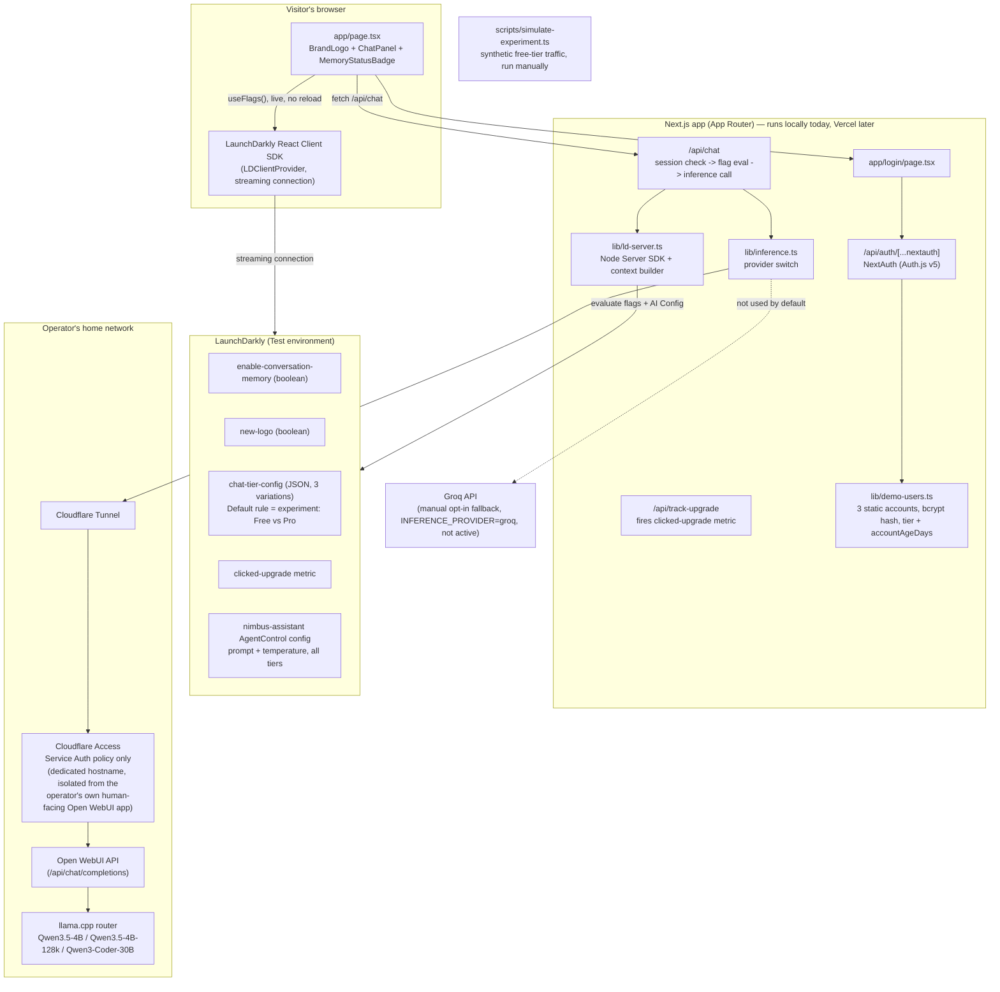

# Architecture & Decisions

Status snapshot as of this document: **release/remediate, targeting,
experimentation, and AI Configs are complete and verified end-to-end.**
Third-party integrations are not yet built. This file exists so the build
can be picked back up, reviewed, or handed off without re-deriving the
reasoning behind it.

## What this app is

**Nimbus** is a self-contained demo project: a small SaaS-style landing page
for a tiered AI chat product (Free / Pro / Enterprise). It is not a real
product — there's no billing, no real user database, no production traffic.
The point of the project is to explore how LaunchDarkly's feature-flag,
targeting, and experimentation tools fit into a real tiered-SaaS pattern,
using tiered model/context access as the running example, since that's a
genuine, common way teams use feature management — not a toy scenario.

Three design constraints have shaped every decision below:
1. **Zero ongoing cost** — the operator didn't want to pay to run this.
2. **No security regression** — nothing here should weaken the operator's
   existing home-lab security posture (see "Cloudflare isolation" below).
3. **A stranger can run it** — a reviewer should be able to clone the repo and
   get the app running without needing the operator's personal infrastructure,
   even though the *deployed* instance depends on it (see "Known gaps").

## Status

| Feature | Status | Flag(s) |
|---|---|---|
| Release & remediate (toggle a feature live, roll it back via a trigger) | ✅ Done, tested | `enable-conversation-memory` |
| Targeting (rule-based + individual overrides) | ✅ Done, tested | `chat-tier-config` |
| Experimentation (metric + experiment on the same flag) | ✅ Done, tested | `chat-tier-config` + `clicked-upgrade` metric |
| AI Configs (managed prompt/parameter tuning) | ✅ Done, tested | `nimbus-assistant` (AgentControl config, separate from the flags above) |
| Third-party integrations | ⏳ Parked, lowest priority — see "Known gaps" | — |
| Vercel deployment | ⏳ Not started — app only runs locally so far | — |
| README setup instructions | ✅ Done | — |

## Architecture

Two SDKs are deliberately both in play: the **client-side React SDK** powers
the live "Memory: On/Off" badge (it needs a real browser connection to prove
the no-reload behavior), while the **server-side Node SDK** makes every
decision that actually matters for security or cost — which model to call,
how much conversation history to send — because that logic must not be
spoofable from the browser.

## Key decisions

**Fresh project instead of an existing one.** Three personal projects were
considered and ruled out: an Open WebUI deployment (no custom app code to
flag), a retro-game cabinet (explicitly marked "do not publish," plus ROM
copyright exposure), and a Jellyfin media vault (real household infra, heavy
Docker/DB dependency chain for a reviewer to stand up). Building fresh avoided
forcing a LaunchDarkly demo into something it didn't fit.

**Local-hosted models as the primary backend, Groq as a manual fallback only.**
The operator already runs a llama.cpp router with three usable models
(`Qwen3.5-4B`, `Qwen3.5-4B-128k`, `Qwen3-Coder-30B-A3B-Instruct-UD-Q4_K_XL`) —
using them costs nothing and maps naturally onto Free/Pro/Enterprise. Groq's
code path (`lib/inference.ts`) is fully implemented but never exercised by
default, and is switched on only via `INFERENCE_PROVIDER=groq` — deliberately
not an automatic failover, so a background process (like the eventual
experiment traffic simulator) can never silently incur real charges.

**Cloudflare isolation: a dedicated hostname, not a shared one.** The first
attempt added a path-scoped (`/api/*`) Access application on the operator's
*existing* Open WebUI hostname. That broke the live app: Access issues a
session per Application (keyed by its own AUD), so the browser's session for
the root app didn't satisfy the new one, and Open WebUI's own background
`fetch()` calls to `/api/*` got silently redirected to a login page instead of
JSON — a reload loop. The fix was a **second, fully separate hostname**
(`nimbus-api.<domain>`) on the same tunnel, pointed at the same origin, with
its own Access application carrying exactly one policy: **Service Auth**, no
human login path at all. This also respects a rule already documented in the
operator's own Local AI repo — never tunnel llama.cpp's port directly — since
this still only ever reaches it through Open WebUI's API.

**No database.** Three static demo accounts (`lib/demo-users.ts`), bcrypt-hashed
passwords, NextAuth (Auth.js v5) Credentials provider, JWT sessions carrying
`tier` and `accountAgeDays`. A real user table would be pure overhead for a
demo whose entire job is to show LaunchDarkly concepts — the static list still
gives real per-account identity for context attributes and individual
targeting.

**The chat is gated behind login.** Originally built open, then deliberately
locked down: an ungated chat box on a publicly deployed app is an open
invitation to flood a home GPU with anonymous requests. `/api/chat` checks
the session itself and returns `401` — enforcement lives server-side, not in
whether the UI happens to show a button.

**Individual targeting is downgrade-only, not an upgrade.** The first version
targeted `demo-free` → Enterprise Tier as a "surprise upgrade" story. That was
wrong: `demo-free@nimbus.app` / `nimbus-demo` is printed on the public login
page, so it would have handed out unlimited free access to the most expensive
model to anyone who found the repo. The override now targets `demo-pro` →
Free Tier instead ("stepped down for exceeding fair use") — a realistic
SaaS pattern that proves individual targeting overrides a rule without ever
granting more access than a tier's own public documentation already implies.

**AI Config and chat-tier-config are two systems with two different jobs, not
one duplicated.** `chat-tier-config` stays the access-control layer — which
model backend and context length an account's *tier* is allowed. The new
`nimbus-assistant` AI Config (LaunchDarkly's AgentControl product; the SDK
still calls it `LDAIConfig`/`completionConfig`) controls the assistant's
system prompt and `temperature` for every account regardless of tier —
a product/prompt-tuning concern, not an access-control one. Its own `model`
field exists because the schema requires one, but the app never reads it for
routing, specifically so the two systems can't fight over which one decides
the backend. Worth being explicit about what LaunchDarkly's AI Config
actually is here: it does not host or run any model — it only serves
*configuration* (prompt text, parameters) the same way a regular flag serves
a value. The real inference call, and whatever credentials it requires, is
still entirely on this app's own code (`lib/inference.ts`), unchanged by
adding this.

**Avoided LaunchDarkly's official OpenAI provider package.**
`@launchdarkly/server-sdk-ai-openai` would have been the "blessed" way to
auto-invoke a model from an AI Config, but it pins `openai@>=4 <7` while this
app already runs `openai@7`. Downgrading a working dependency just to use an
optional convenience wrapper wasn't worth it. Instead, `app/api/chat/route.ts`
calls `aiClient.completionConfig()` for the prompt/parameters, keeps calling
the existing `chatCompletion()` exactly as before, and wraps that call in the
AI Config's own `tracker.trackMetricsOf()` to report real token/latency/
success metrics back to LaunchDarkly — same outcome, zero new dependency
conflicts.

**Closed-group review via a privately shared `.env.local`, not public self-service.**
The README leads with "clone the repo, drop in the `.env.local` you were
given, run it" rather than "set up your own LaunchDarkly account and model
backend." The real LD environment (with the flags, targeting, and experiment
already configured) and a working inference backend are shared directly with
reviewers outside the repo, not published. The from-scratch setup
instructions still exist in the README as a secondary path, both for
transparency into how it works and for anyone who genuinely wants to
reproduce it independently — but they're not the primary flow.

**Project-local Node 22, not a system upgrade.** The dev machine's system Node
(18.19.1) is older than what Next.js 16 / Tailwind v4 require. Rather than
touch the operator's system Node, a Node 22 binary lives at `.tools/node/`
(gitignored, never committed) — invisible to the shipped repo, which simply
documents "Node 20+" as an ordinary prerequisite.

## Flag and AI Config inventory

| Key | Type | Client-side? | Purpose |
|---|---|---|---|
| `sanity-check` | boolean | yes | Early connectivity check only; removed from code once real flags landed. Safe to delete from the dashboard. |
| `enable-conversation-memory` | boolean | yes (needs the live badge) | Release & remediate demo. Gates whether `/api/chat` forwards conversation history or treats every message as stateless. Has a Generic trigger wired to turn it off, for the remediation demo. |
| `new-logo` | boolean | yes (needs the live swap) | Gates the redesigned cloud + wordmark logo (`components/Logo.tsx`) vs. the original plain text wordmark, via `components/BrandLogo.tsx`. A second, independent example of the release/remediate pattern — applied to a brand/visual rollout instead of a product feature, which is a genuinely common real-world use of flags. Defaults to the new logo if the flag is missing. |
| `chat-tier-config` | JSON (3 variations: `free` / `pro` / `enterprise`) | no (server-only) | Targeting demo. Each variation is `{ model, maxContextMessages, label }`. Rule-based on the context's `tier` attribute; one individual target (`demo-pro` → `free`, a downgrade). Its Default rule also hosts the experiment below. |

Context sent to LaunchDarkly: `{ kind: "user", key: <demo account id>, email,
tier, accountAgeDays }`, built in `lib/ld-server.ts#buildUserContext` from the
NextAuth session — never from client input.

**Experiment:** on `chat-tier-config`'s Default rule — Free Tier (control)
vs. Pro Tier, 50/50, among contexts that reach that rule (i.e. `tier` isn't
`pro` or `enterprise`). Enterprise Tier is explicitly excluded from the
experiment's variation set entirely (not just weighted low) — an earlier
pass defaulted to a 3-way split across all of the flag's variations, which
would have randomly routed a slice of free-tier traffic to the most
expensive model. Primary metric: `clicked-upgrade` (Count/average-per-user,
which behaves like a conversion rate here since the UI's upgrade button only
fires it once per account). `scripts/simulate-experiment.ts` generates
synthetic free-tier sessions against it — real LD exposures and events, but
documented as synthetic data since the app has no production audience.

**AI Config:** `nimbus-assistant`, an AgentControl config in Completion mode
(not a flag, but evaluated the same way via `aiClient.completionConfig()`).
One variation: a custom-registered model entry (`Qwen3.5-4B (Self Hosted)`,
$0 token costs — accurate, since it's self-hosted) with a `temperature`
parameter, plus a system-message prompt. Both the prompt and temperature are
re-fetched from LaunchDarkly on every chat request and passed straight into
the real inference call — confirmed live by editing the prompt in the
dashboard mid-session and watching the very next response change tone with
no redeploy. Wrapped in `aiConfig.createTracker().trackMetricsOf()` so token
usage, success, and duration report back to LaunchDarkly automatically.

## Known gaps (intentional, not forgotten)

- **No Vercel deployment yet.** Everything above has been verified against
  the local dev server only. Connecting Vercel early was part of the original
  plan; that got deferred in favor of getting the auth/targeting/inference/
  experimentation wiring solid first, and is intentionally on hold until the
  app is considered ready for a public listing.
- **Groq path is implemented but untested.** It type-checks and follows the
  same interface as the local path, but no live request has gone through it.
- **Integrations (optional extra credit) parked, not abandoned.** Researched
  GitHub Code References as the best fit — it would link each flag/config
  key directly to the exact lines using it in this repo. Found a real
  constraint before building anything: LaunchDarkly's dashboard-integrated
  Code References panel is gated to paid plans ("contact Sales to upgrade"),
  which a trial account won't have. Their docs point to a lighter-weight
  alternative for Developer/Foundation-tier accounts — a GitHub Action
  ("Flag Code References in Pull Request") that comments directly on a PR's
  diff instead of writing into LD's paid dashboard feature. That alternative
  wasn't evaluated in depth before pausing this. Revisit if the LaunchDarkly
  plan on the account changes, or if the PR-comment variant turns out to work
  on the current plan — worth a quick check before writing it off entirely.
