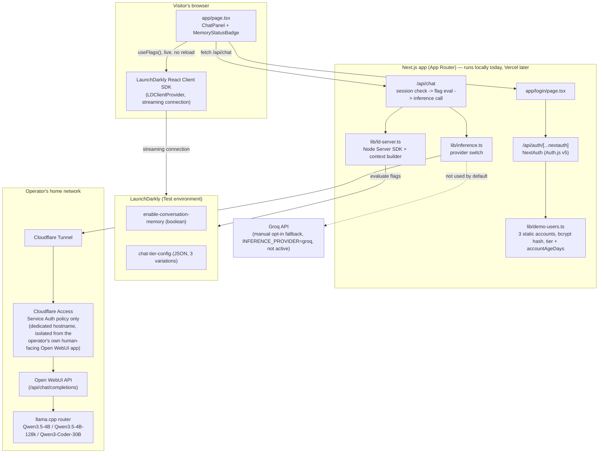

# Architecture & Decisions

Status snapshot as of this document: **Part 1 and Part 2 of the LaunchDarkly SE
exercise are complete and verified end-to-end.** Experimentation, AI Configs,
and Integrations (extra credit) are not yet built. This file exists so the
build can be picked back up, reviewed, or handed off without re-deriving the
reasoning behind it.

## What this app is

**Nimbus** is a small SaaS-style landing page for a tiered AI chat product
(Free / Pro / Enterprise), built from scratch as the vehicle for LaunchDarkly's
SE technical exercise. It is not a real product — there's no billing, no real
user database, no production traffic. The entire point of the app is to give
every required and extra-credit item in the exercise a genuine, coherent home
instead of a contrived one: tiered model/context access via flags is a real,
common LaunchDarkly use case, not a toy example built to fit the assignment.

Three design constraints have shaped every decision below:
1. **Zero ongoing cost** — the operator didn't want to pay for this exercise.
2. **No security regression** — nothing here should weaken the operator's
   existing home-lab security posture (see "Cloudflare isolation" below).
3. **A stranger can run it** — a reviewer should be able to clone the repo and
   get the app running without needing the operator's personal infrastructure,
   even though the *deployed* instance depends on it (see "Known gaps").

## Status

| Requirement | Status | Flag(s) |
|---|---|---|
| Part 1 — Release and Remediate | ✅ Done, tested | `enable-conversation-memory` |
| Part 2 — Target | ✅ Done, tested | `chat-tier-config` |
| Extra credit — Experimentation | ⏳ Not started | will reuse `chat-tier-config` |
| Extra credit — AI Configs | ⏳ Not started | new, separate from the flags above |
| Extra credit — Integrations | ⏳ Not started, lowest priority | — |
| Vercel deployment | ⏳ Not started — app only runs locally so far | — |
| README setup instructions | ⏳ Still the default `create-next-app` stub | — |

## Architecture

Two SDKs are deliberately both in play: the **client-side React SDK** powers
the live "Memory: On/Off" badge (it needs a real browser connection to prove
the no-reload requirement), while the **server-side Node SDK** makes every
decision that actually matters for security or cost — which model to call,
how much conversation history to send — because that logic must not be
spoofable from the browser.

## Key decisions

**Fresh app instead of an existing project.** Three personal projects were
considered and ruled out: an Open WebUI deployment (no custom app code to
flag), a retro-game cabinet (explicitly marked "do not publish," plus ROM
copyright exposure), and a Jellyfin media vault (real household infra, heavy
Docker/DB dependency chain for a reviewer to stand up). Building fresh avoided
forcing the exercise into something it didn't fit.

**Local-hosted models as the primary backend, Groq as a manual fallback only.**
The operator already runs a llama.cpp router with three usable models
(`Qwen3.5-4B`, `Qwen3.5-4B-128k`, `Qwen3-Coder-30B-A3B-Instruct-UD-Q4_K_XL`) —
using them costs nothing and maps naturally onto Free/Pro/Enterprise. Groq's
code path (`lib/inference.ts`) is fully implemented but never exercised by
default, and is switched on only via `INFERENCE_PROVIDER=groq` — deliberately
not an automatic failover, so a background process (like the eventual
experiment traffic simulator) can never silently incur real charges.

**Cloudflare isolation: a dedicated hostname, not a shared one.** The first
attempt added a path-scoped (`/api/*`) Access application on the operator's
*existing* Open WebUI hostname. That broke the live app: Access issues a
session per Application (keyed by its own AUD), so the browser's session for
the root app didn't satisfy the new one, and Open WebUI's own background
`fetch()` calls to `/api/*` got silently redirected to a login page instead of
JSON — a reload loop. The fix was a **second, fully separate hostname**
(`nimbus-api.<domain>`) on the same tunnel, pointed at the same origin, with
its own Access application carrying exactly one policy: **Service Auth**, no
human login path at all. This also respects a rule already documented in the
operator's own Local AI repo — never tunnel llama.cpp's port directly — since
this still only ever reaches it through Open WebUI's API.

**No database.** Three static demo accounts (`lib/demo-users.ts`), bcrypt-hashed
passwords, NextAuth (Auth.js v5) Credentials provider, JWT sessions carrying
`tier` and `accountAgeDays`. A real user table would be pure overhead for a
demo whose entire job is to show LaunchDarkly concepts — the static list still
gives real per-account identity for context attributes and individual
targeting.

**The chat is gated behind login.** Originally built open, then deliberately
locked down: an ungated chat box on a publicly deployed app is an open
invitation to flood a home GPU with anonymous requests. `/api/chat` checks
the session itself and returns `401` — enforcement lives server-side, not in
whether the UI happens to show a button.

**Individual targeting is downgrade-only, not an upgrade.** The first version
targeted `demo-free` → Enterprise Tier as a "surprise upgrade" story. That was
wrong: `demo-free@nimbus.app` / `nimbus-demo` is printed on the public login
page, so it would have handed out unlimited free access to the most expensive
model to anyone who found the repo. The override now targets `demo-pro` →
Free Tier instead ("stepped down for exceeding fair use") — a realistic
SaaS pattern that proves individual targeting overrides a rule without ever
granting more access than a tier's own public documentation already implies.

**Project-local Node 22, not a system upgrade.** The dev machine's system Node
(18.19.1) is older than what Next.js 16 / Tailwind v4 require. Rather than
touch the operator's system Node, a Node 22 binary lives at `.tools/node/`
(gitignored, never committed) — invisible to the shipped repo, which simply
documents "Node 20+" as an ordinary prerequisite.

## Flag inventory

| Key | Type | Client-side? | Purpose |
|---|---|---|---|
| `sanity-check` | boolean | yes | Milestone-2 connectivity check only; removed from code once real flags landed. Safe to delete from the dashboard. |
| `enable-conversation-memory` | boolean | yes (needs the live badge) | Part 1. Gates whether `/api/chat` forwards conversation history or treats every message as stateless. Has a Generic trigger wired to turn it off, for the remediation demo. |
| `chat-tier-config` | JSON (3 variations: `free` / `pro` / `enterprise`) | no (server-only) | Part 2. Each variation is `{ model, maxContextMessages, label }`. Rule-based on the context's `tier` attribute; one individual target (`demo-pro` → `free`, a downgrade). |

Context sent to LD: `{ kind: "user", key: <demo account id>, email, tier,
accountAgeDays }`, built in `lib/ld-server.ts#buildUserContext` from the
NextAuth session — never from client input.

## Known gaps (intentional, not forgotten)

- **No Vercel deployment yet.** Everything above has been verified against
  the local dev server only. Milestone 1's plan included connecting Vercel
  early; that got deferred in favor of getting the LD/auth/inference wiring
  solid first.
- **`README.md` is still the unmodified `create-next-app` default.** Setup
  instructions, the demo script, and the "how to run this" walkthrough the
  assignment explicitly asks for haven't been written yet — planned for the
  final-polish pass.
- **Groq path is implemented but untested.** It type-checks and follows the
  same interface as the local path, but no live request has gone through it.
